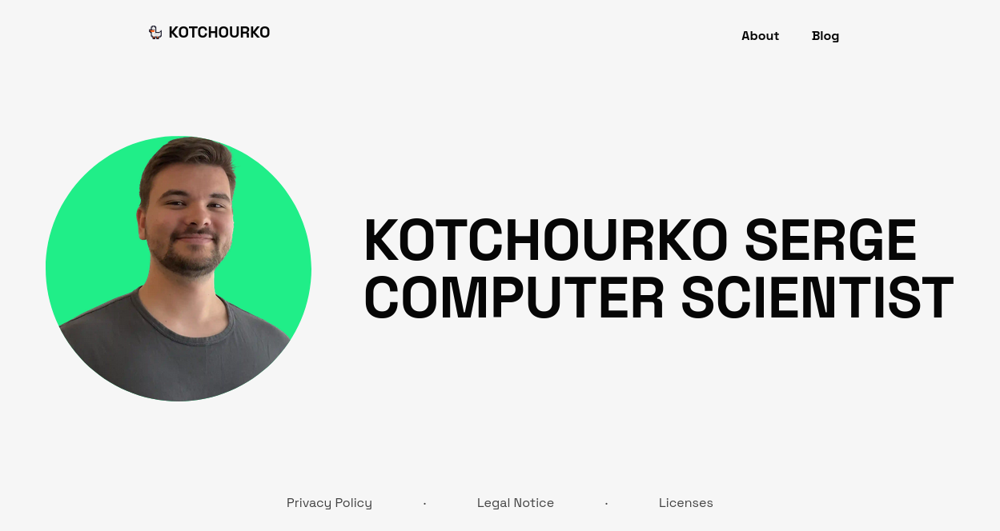

# Homepage

## Description

This repository contains the source code for my [homepage](https://kotchourko.dev/).

## Usage

Currently my [homepage](https://kotchourko.dev/) is hosted on [IONOS](https://www.ionos.de/). The homepage is built using mainly [Next.js](https://nextjs.org/) and [Tailwind CSS](https://tailwindcss.com/). The blog posts are written in [Markdown](https://www.markdownguide.org/) and converted to HTML using [micromark](https://github.com/micromark/micromark) and [Katex](https://katex.org/).

If you want to run the homepage locally, you can do so by cloning this repository and running `npm run dev` or `yarn dev` in the root directory after installing the dependencies. This will start a local server on port 3000.

## License

This project is licensed under the MIT License - see the [LICENSE](/LICENSE) file for details. Note that this only extends to my code and other modules, fonts, etc. are licensed under their respective licenses and do not fall under this license. You can find the licenses of the different modules [here](/LICENSE.DEPENDENCIES.md). If you find any license violations, please contact me immediately, as this is not intended.

## Contributing

If you have any suggestions or find any bugs, feel free to open an issue or a pull request. I will try to respond as soon as possible. You can also contact me via, which can be found on my homepage under Legal Notice.
